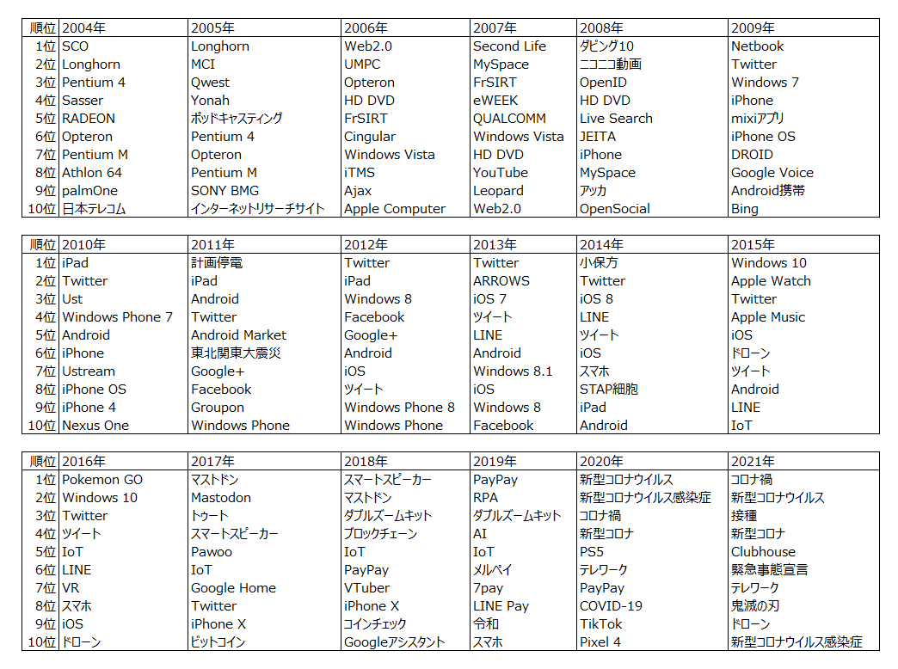

```{r setup, include=FALSE}
# メモ: results="hide"/code_folding:trueからのclass.source="fold-show"

knitr::opts_chunk$set(echo=TRUE,include=TRUE,message=FALSE,warning=FALSE,error=FALSE,tidy=FALSE,cache=FALSE)
# 例：out.width="800px",out.height="400px",fig.width=6,fig.height=3,dpi=300
# -> 画像そのものは3600(6*300*2)x1800(3*300*2)であり、それを画面上800x400に縮小して表示する
# out.width="100%"とすると、cssの横幅（約890px）となる
knitr::opts_chunk$set(out.width="100%",fig.width=8,fig.height=4,dpi=300)
library(tidyverse)
library(magrittr)
library(knitr)
library(here)
```


## 概要

[ITmedia NEWS](https://www.itmedia.co.jp/news/)の記事データについて、TF-IDFを用いて毎年の「その年のIT分野の世相を表す単語」をピックアップしました。

## 記事データ

まずは記事のテキストデータを入手する必要があります。

[過去記事一覧](https://www.itmedia.co.jp/news/subtop/archive/)からスクレイピングで辿ることで、2004年1月以降の全ての記事を取得しました[^1]。サーバに負荷がかからないよう、十分なスリープを挟みました。

[^1]: これだけ長い期間の記事が消えずに残っていること自体、大変な価値があると思います。

2004/1/7～2021/7/31において88638本の記事がありました。そのうち実際に取得できた記事は88249本でした。

```{r,include=FALSE,results="hide"}
article <- read_csv(here("data/ITmedia_news_article_0401_2107.csv"),locale=locale(tz="Asia/Tokyo")) %>% 
  select(-subtitle,-author) %>% 
  arrange(datetime)
```

記事の日時、タイトル、本文、URLを取得しました。以降、このテキストデータを用いて分析を行います。

```{r,echo=FALSE,df_print="tibble",rows.print=5}
article
```

## TF-IDF

本分析で求めたいのは、「他の年の記事にはあまり出てこないが、ある年の記事によく出てきた単語」です。本分析では、この度合いを示す指標としてTF-IDFを用います。

ある文書にはあまり出現しないが他のある文書にはよく出現する単語は大きな値を取る性質があり、特徴語の特徴量としてよく用いられます。

文書$j$における単語$i$のTF-IDFは、TF（Term Frequency、単語の出現頻度）とIDF（Inverse Document Frequency、逆文書頻度）の積で表され、下記の通り求められます。

$$
\begin{align}
tfidf_{i,j} &= tf_{i,j} \cdot idf_{i} \\
tf_{i,j} &= \frac{文書jにおける単語iの出現回数} {文書jにおける全ての単語の出現回数の和} \\
idf_{i} &= \log \frac{総文書数}{単語iが出現する文書数}
\end{align}
$$

本分析では、文書カテゴリ（上での$j$）は投稿日の年数（2004年～2021年）です。すなわち、2004年に投稿されたニュース群、2005年に投稿されたニュース群、…、2021年に投稿されたニュース群というように、18個の文書カテゴリがあります。

なお、TFとIDFの定義は、上記以外に色々あります。（例えば[いろんなtf-idf](https://yukinoi.hatenablog.com/entry/2016/11/12/231422)）今回は他にも、TFの2値化や、IDFを単語iが出現する文書数+1の自然対数としたバージョンも試してみましたが、結果がよくなかったため割愛します。[^2]

[^2]: 前者：今回のようなニュース文章だと、同じニュースの中に1回しか出てこない単語よりも5回出てくる単語の方がそのニュースのトピックになるような重要な単語なので、両者に同じ1というTFを振る2値化は不適当ということです。後者：文書カテゴリが2004～2021年の18個（$j=1 \dots 18$)しかないので、logを取ると1個の文書にしか出てこない単語と18個全ての文書に出てくる単語のIDFがあまり変わらず、IDFとして機能しなくなったからだと思います。

Rでは、tidytext::bind_tf_idfを用いてTF-IDFが求められます。ただ、実装は特に難しくありませんので、自分の理解を兼ねてtidyverseでの集計によって一から実装しました。なお、tidytext::bind_tf_idfは上記の数式の通りの最もオーソドックスなTF-IDFの算出法しか実装されていませんので、他の方法でのTF-IDFを求めたい場合は一から実装する必要があります。

## 実装

実装は下記の通りになります。

- 前処理
  - 記事中に含まれる年月日や、かっこ内の語を削除する
    - かっこ内の語は、その前にある単語の略語のことが多いです。その略す前の単語と略した後の単語で同じ意味の単語が2個結果に入ってしまうので、削除しました。
  - [neologdベース](https://github.com/neologd/mecab-ipadic-neologd/wiki/Regexp)での正規化を行う
    - NFKC正規化の後に、各種文字を正規化します。
    - [zipangu::str_jnormalize](https://github.com/uribo/zipangu)を用いています。Pythonの[neologdn.normalize](https://github.com/ikegami-yukino/neologdn)と同じです。
  - 前処理とは少し違いますが、記事の投稿年（"2004"-"2021"）を各ニュースに付与します。
- 形態素解析
  - RMeCabに、新語・固有表現に強い[mecab-ipadic-NEologd](https://github.com/neologd/mecab-ipadic-neologd)を用いています。実際は、RMeCabの出力を扱いやすくtidyにする自作パッケージ[mecabtools](https://github.com/suzuna/mecabtools)を用いています。
    - mecab-ipadic-NEologdですが、GitHubを見る限りどうやら2020年9月で更新が止まっているようです。更新停止後に出てきた最近の単語は分かち書きできませんね。
  - [furrr::future_map](https://github.com/DavisVaughan/furrr)を用いて並列化しています。Core i9-9900K、メモリ64GBの私の環境では数分程度で終わりました。
- TF-IDF算出
  - 数詞以外の名詞のうち、全てのニュースの中で30回以上出現している単語のみにしました。
- 結果
  - 各年（＝文書カテゴリ）のTF-IDFの上位10単語を選びました。

```{r,eval=FALSE,include=TRUE,results="hide"}
library(tidyverse)
library(lubridate)
# remotes::install_github("suzuna/mecabtools")
library(mecabtools)
# CRAN版ではなくGitHubにある開発版を入れる（2022/1/30時点では、zipangu::str_jnormalizeがCRAN版（v0.2.3）にはないため）
# remotes::install_github("uribo/zipangu")
library(zipangu)
library(here)
library(furrr)


# 事前に集めたデータを読み込む -------------------------------------------------------------------
article <- read_csv(here("data/ITmedia_news_article_0401_2107.csv"),locale=locale(tz="Asia/Tokyo")) %>% 
  arrange(datetime)


# 前処理する -------------------------------------------------------------------
df <- article %>% 
  mutate(content=str_remove_all(content,"<p>")) %>% 
  # かっこ内の単語を削除（かっこ内の単語は前の単語の略語のことが多いため、同じ意味を持つ略す前の単語と略語が重複するから）
  mutate(content=str_remove_all(content,"（[^）]*）")) %>% 
  # 記事中の年月日は削除
  mutate(content=str_remove_all(content,"[0-9]+(年|年度|月|日)")) %>% 
  mutate(content=zipangu::str_jnormalize(content)) %>% 
  # このyearが、文書カテゴリ
  mutate(year=lubridate::year(datetime),id=str_extract(url,"[0-9]{4}/[0-9]{2}/news[0-9]+")) %>% 
  select(id,year,title,content,url)


# 形態素解析 -------------------------------------------------------------------
plan(multisession)
tictoc::tic()
keitaiso <- df %>% 
  mutate(content=iconv(content,"UTF-8","Shift-JIS")) %>% 
  mutate(tmp=future_map(content,~mecabtools::pos_full(.x,NULL),.progress=T)) %>%
  unnest(tmp)
tictoc::toc()
plan(sequential)


# TF-IDFを算出する ---------------------------------------------------------------
words <- keitaiso %>% 
  filter(pos=="名詞") %>% 
  filter(pos1!="数") %>% 
  select(id,year,surface)
df_n <- words %>% 
  count(year,surface,name="n")

unique_article_n <- words %>% 
  group_by(surface) %>% 
  summarize(n_article=length(unique(id)))
# 出現回数が全ての記事で30回未満の単語を除外する
used_words <- unique_article_n %>% 
  filter(n_article>=30) %>% 
  pull(surface)

# 文書カテゴリの数（2004～2021年の18個）
n_doc_all <- df_n %>% 
  pull(year) %>% 
  unique() %>% 
  length()

tf_idf <- df_n %>% 
  filter(surface %in% used_words) %>% 
  mutate(tf=n/sum(n)) %>%
  add_count(surface,name="n_doc") %>% 
  mutate(idf=log(n_doc_all/n_doc)) %>%
  mutate(tf_idf=tf*idf)


# TF-IDF上位の単語を取り出す --------------------------------------------------------
res <- tf_idf %>% 
  arrange(year,desc(tf_idf)) %>%
  group_by(year) %>%
  mutate(rank=row_number(desc(tf_idf))) %>%
  ungroup() %>%
  filter(rank<=100)

# 見た目を整えたテーブル
res_table <- res %>% 
  select(year,surface,rank) %>% 
  filter(rank<=20) %>% 
  pivot_wider(names_from=year,values_from=surface,names_glue="{.name}年") %>% 
  mutate(rank=str_c(rank,"位"))
```

## 結果

こちらです。各年の時勢をうまく表していますね！



- 2020年～2021年に、「新型コロナ」、「新型コロナウイルス」、「新型コロナウイルス感染症」と3つありますが、表記の揺らぎです。本当はきちんと統一する必要があります。
  - この3単語だけなら前処理で対応できますが、表記揺れを網羅的に補正するとなるととても大変です。この辺りに自然言語処理の実用上の難しさがあります。
  - しかし、それを差し引いてもこの2年間は新型コロナ一色でした。
- 2005年の「インターネットリサーチサイト」は、アンケートサイトです。この年の記事には、このサイトでのアンケート結果を示す記事が特に多かったためランクインしています。これもある種自然言語処理上のノイズですね。
